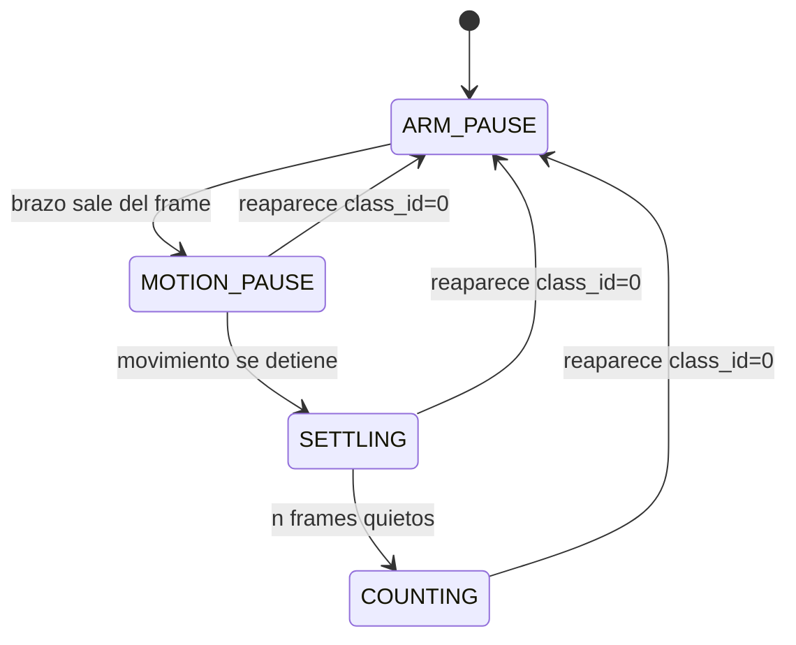
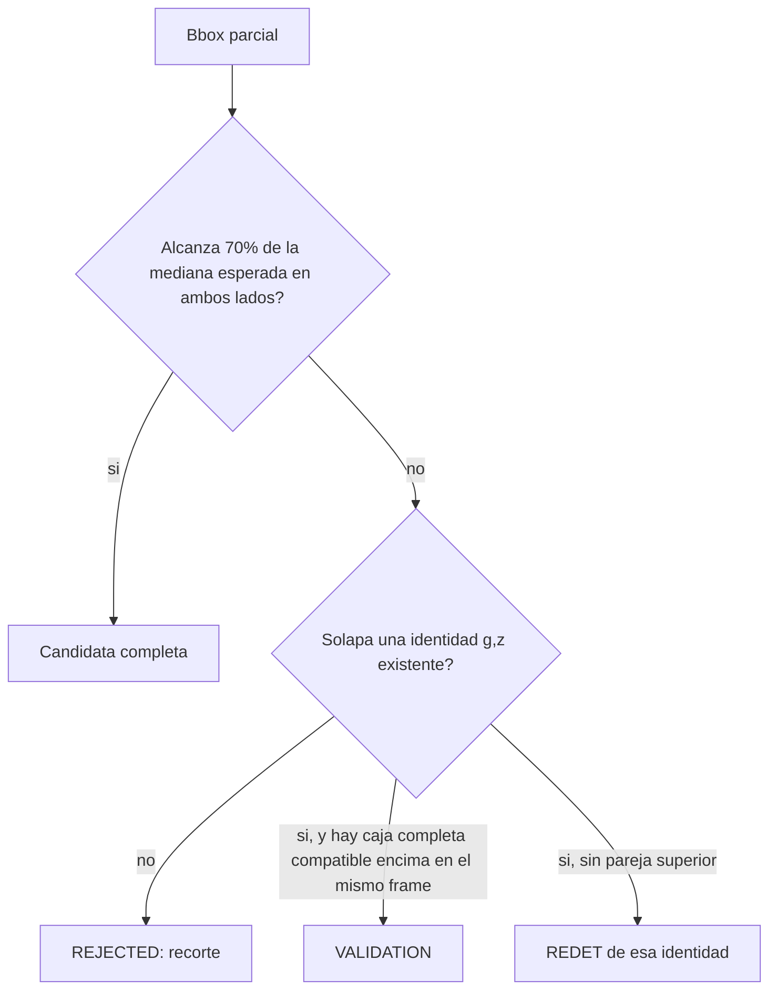
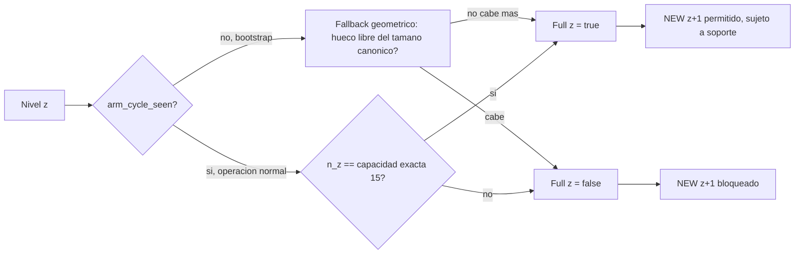
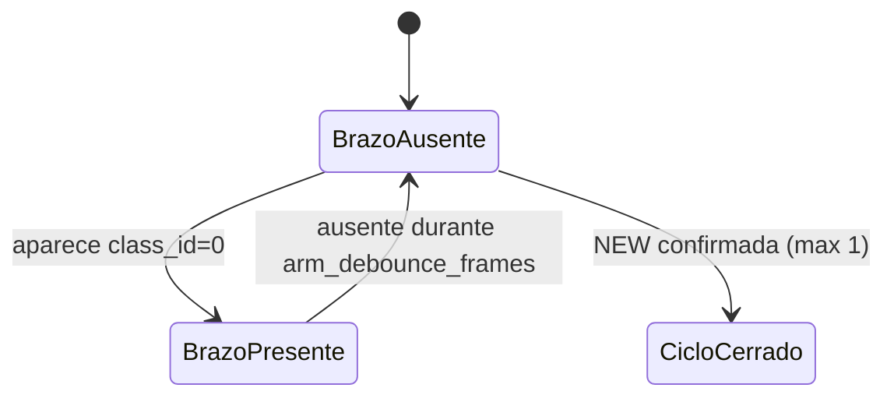
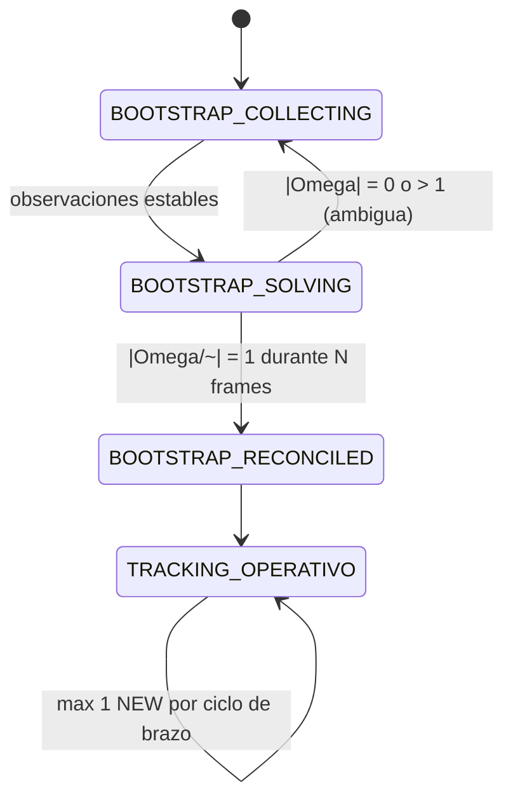

# Conteo robusto de cajas paletizadas

## 1. Propósito y alcance

Este documento explica **cómo funciona** el contador de paletizado: flujo
por frame, máquinas de estado, qué decide cada módulo y qué está
efectivamente implementado hoy. La demostración matemática de cada regla —
por qué la mediana, por qué el área conserva información bajo oclusión, por
qué la reconciliación inicial es un problema de identificabilidad — vive en
[`palletizing_math.md`](palletizing_math.md), referenciado por sección en
cada punto donde aplica.

Distinción de estado usada en todo el documento:

- **IMPLEMENTADO**: comportamiento presente en el código.
- **PROPUESTO**: regla física solicitada que todavía requiere implementación.
- **LÍMITE OBSERVABLE**: conclusión que una cámara cenital 2D no puede probar
  por sí sola (ver [`palletizing_math.md` §9](palletizing_math.md#9-límites-teóricos-de-una-cámara-cenital-2d)).

YOLO produce observaciones efímeras. La identidad, el nivel y el conteo son
decisiones del dominio, repartidas así:

| Módulo | Responsabilidad |
|---|---|
| `vision/inference.py` | `model.predict()`, separación de clases, gate global |
| `vision/palletizing/templates/<clase>.py` | datos estaticos A/B: 15 rectangulos normalizados H/V por producto |
| `vision/palletizing/templates/template_runtime.py` | compila una sola vez los datos por clase y alterna la fase por nivel |
| `vision/palletizing/templates/template_matcher.py` | matching de huecos y ajuste global uno-a-uno de una o dos capas |
| `vision/palletizing/templates/template_render.py` | render/CLI de diagnostico sin imagen de camara |
| `vision/palletizing/bootstrap.py` | decide la fase inicial A/B y reconstruye niveles ocultos |
| `vision/palletizing/levels.py` | tracking operativo despues de fijar la fase |
| `vision/isometric.py` | render de un estado ya resuelto |
| `configs/vision.yaml` | parámetros del detector |
| `configs/palletizing.yaml` | reglas físicas y calibración |

No existe ByteTrack, `track_id` ni `model.track()`. La identidad se
reconstruye por geometría, frame a frame.

---

## 2. Vista de conjunto

```mermaid
flowchart LR
    A[Frame de camara] --> B[YOLO: model.predict]
    B --> C{Gate del brazo}
    C -->|brazo presente| D[ARM_PAUSE: descartar cajas]
    C -->|escena estable| E[ROI + homografia]
    E --> F{Bootstrap reconciliado?}
    F -->|no| G[Clasificar completas y parciales]
    G --> H[Probar N0=A/B y una/dos capas]
    H --> I{|Omega fase,niveles| unica y estable?}
    I -->|no| G
    I -->|si| J[Materializar ocultas + publicar ISO]
    F -->|si| K[Matching contra identidades confirmadas]
    J --> K
    K --> L[Confirmar como maximo un NEW por ciclo]
    L --> M[SceneState + JSON atomico]
```

---

## 3. Contrato del modelo multiclase

Un único modelo YOLO conoce varias clases de caja, pero la instalación opera
sobre una sola a la vez:

```yaml
active_box_class: caja_1sol
boxes_per_level:
  caja_bolsa_0.10: 25
  caja_cartucho_0.10: 25
  caja_1sol: 15
  caja_cartucho_2.00: 25
```

Para `caja_1sol`, la capacidad física es 15 cajas por nivel. La coincidencia
de nombre con `model.names` es exacta — no se toma la primera etiqueta que
empiece por `caja`, porque el modelo distingue varios productos.

El brazo se identifica mediante `detection.arm_class_name`
(`cnm-palletsCajas`). Solo las clases declaradas en
`detection.box_class_names` pueden llegar al contador. Se configura por
nombre y no por id porque los ids se corren al reentrenar con etiquetas
nuevas — ver [configs/vision.md](configs/vision.md).

**Estado: IMPLEMENTADO.**

---

## 4. Gate del brazo



Si la clase configurada del brazo aparece en **cualquier parte** del frame, la posición
de su bbox respecto al ROI es irrelevante: se vacía la lista de cajas
entregada al contador. YOLO sigue corriendo, pero ese frame:

1. no construye ningún bbox de caja;
2. no actualiza candidatas, matching, niveles ni conteo;
3. no dibuja ninguna detección de caja;
4. dibuja únicamente el robot y la causa de la pausa;
5. corta cualquier racha de confirmación temporal pendiente.

Sin brazo, solo se acepta la clase activa con centro dentro del ROI.

**Estado: IMPLEMENTADO.**

---

## 5. Geometría normalizada

El ROI se rectifica con una homografía a `[0,1]²`
([`palletizing_math.md` §1](palletizing_math.md#1-objetos-primitivos)). El
bbox rectificado produce un footprint `(u, v, d_u, d_v)`, del que se derivan
lado corto (`a = min`) y lado largo (`ℓ = max`), con la orientación guardada
aparte para que una caja horizontal y una girada 90° alimenten las mismas
estadísticas de tamaño sin perder cómo se debe dibujar.

**Estado:** `_measure_footprint()` mide `(d_u, d_v)` y
`_canonical_footprint()` conserva la orientación. **IMPLEMENTADO.**

---

## 6. Tamaño robusto: mediana, nunca promedio

Cada clase y nivel estima su tamaño canónico como la mediana del lado corto
y del lado largo observados, filtrada por desviación absoluta mediana
(MAD) para que una observación inflada o recortada no la contamine. La
justificación completa —por qué la mediana resiste hasta que menos de la
mitad de las observaciones están contaminadas, y por qué la media
aritmética no— está en
[`palletizing_math.md` §2](palletizing_math.md#2-estimadores-robustos)
(Proposición 2.3).

Para un número par de observaciones se usa la mediana superior (el valor
`sorted(values)[n//2]`), nunca el promedio de las dos centrales: así el
consenso siempre corresponde a una medida realmente observada.

**Estado: IMPLEMENTADO.** `_recompute_level_footprint()` recalcula por
separado la mediana de cada lado cada vez que se confirma una caja. El
filtro de recorte se activa desde tres cajas confirmadas.

---

## 7. Caja parcial: media caja o cuarta caja



`VALIDATION` confirma la relación `(i → i+1)` pero no crea, redimensiona ni
pinta ninguna caja. Nunca se crea una caja más pequeña ni se reduce una
confirmada.

**Precisión de observabilidad.** Un bbox pequeño por sí solo no prueba un
nivel inferior — solo prueba que la observación está truncada. Concluir que
es la parte visible de una caja inferior *existente* exige además: solape
espacial con su footprint confirmado, compatibilidad con una identidad
`(g,z)` existente, preferencia por el nivel confirmado más alto que la
explique, y ausencia de evidencia válida para una caja nueva soportada.

Cuatro `REDET` completas, estables y no ambiguas pueden intercambiar los
ejes de una identidad (`a,ℓ ↔ ℓ,a`) sin cambiar tamaño canónico, nivel ni
conteo — corrige una orientación inicial mal leída sin congelarla para
siempre. La validación de área usa la mediana canónica del nivel, nunca el
bbox inicial potencialmente inflado.

**Estado: IMPLEMENTADO.** Umbral `min_complete_side_ratio = 0.70` por lado.

---

## 8. Identidad espacial persistente y monotonicidad

Una caja confirmada es `I = (g, z)` con ocupación `χ(g,z) ∈ {0,1}`. La única
transición válida es `0 → 1`; una desaparición visual nunca elimina una caja
física confirmada, y ningún matching puede degradar el nivel de una
identidad existente. La formalización axiomática (monotonicidad de
ocupación, no degradación de nivel) está en
[`palletizing_math.md` §4](palletizing_math.md#4-identidad-espacial-y-monotonicidad).

Centro `(u, v)`, nivel, tamaño y orientación son inmutables una vez
confirmados. Las redetecciones posteriores solo validan visibilidad: nunca
reescriben la geometría persistida.

Si una observación principal ya consumió el match de una identidad y aparece
un segundo bbox contenido, este segundo bbox se admite únicamente como
`VALIDATION` cuando es estrictamente menor. La relación es uno-a-muchos solo
para evidencia de oclusión: el fragmento puede achicarse, nunca crecer, crear
otra identidad ni dibujarse como caja independiente.

**Estado: IMPLEMENTADO.**

---

## 9. Confirmación temporal corta

```mermaid
sequenceDiagram
    participant F as Frames COUNTING
    participant C as Candidata
    F->>C: frame t, IoU(B_t, B_t-1) >= 0.25
    F->>C: frame t+1
    F->>C: frame t+2 (3ro consecutivo)
    C->>C: confirmar chi(g,z) = 1
    C->>C: geometria = mediana(B_t-2..B_t)
    Note over C: autoridad pasa a (g,z); racha temporal se descarta
```

Este enlace IoU frame a frame no es tracking persistente: es solo el
pegamento de una racha corta de 3 frames antes de que la identidad
espacial `(g, z)` tome autoridad sobre la caja.

**Estado: IMPLEMENTADO.** `confirmation.min_stable = 3`,
`confirmation.same_box_iou = 0.25`.

---

## 10. Duplicados y matching uno a uno

El código usa `R_min` (no IoU) para decidir si dos observaciones son la
misma caja, precisamente porque un bbox recortado puede quedar casi
contenido en el bbox canónico con IoU bajo — la diferencia entre ambas
razones y por qué `R_min` es la correcta aquí está demostrada en
[`palletizing_math.md` §3](palletizing_math.md#3-razones-de-área)
(Proposición 3.2). Dos detecciones muy solapadas y de tamaño parecido se
deduplican antes del conteo, conservando la de mayor confianza.

El matching final es uno a uno: cada detección explica como máximo una
celda `(g,z)`, cada celda explica como máximo una detección. Criterio
principal `R_min`; distancia entre centroides como respaldo.

**Estado: IMPLEMENTADO.**

---

## 11. No interpenetración dentro de un nivel

Dos cajas físicas distintas del mismo nivel no pueden solaparse más allá de
una tolerancia pequeña de etiquetado. La decisión es **por pareja**, no
por la suma total de solapes contra todos los vecinos.

```text
si solapa mucho una caja existente          -> REDET (misma identidad)
si solapa moderadamente varias del mismo nivel -> REJECTED / ambigua
si todo solape individual está bajo tolerancia  -> puede ser NEW
```

**Estado: IMPLEMENTADO.** Reuso de identidad con `tau_cell_overlap = 0.35`;
precondición dura para crear una identidad nueva con
`max_same_level_overlap = 0.10` — si la supera, se rechaza como
`solape-intranivel`.

---

## 12. Nivel completo y promoción monótona



Nunca puede iniciarse el nivel `z+1` mientras `z` esté incompleto. En
operación normal manda la capacidad exacta (15); durante el **bootstrap**
(antes del primer ciclo de brazo, inventariando una paleta que ya vino
apilada) esa condición es imposible de cumplir por construcción — una caja
del piso que nació tapada nunca entra a `_occupied` — así que se usa el
mismo fallback geométrico de huecos libres.

**Estado: IMPLEMENTADO.** `_level_is_full` — capacidad exacta solo con
`arm_cycle_seen = True`; antes, chequeo geométrico de huecos libres.

---

## 13. Soporte trabado generalizado

Una candidata superior sube de nivel solo si su centroide cae dentro del
polígono convexo formado por **todos** los contactos válidos y existen al
menos dos soportes independientes. Los contactos residuales menores que el
error de raster/localización se descartan. Si el hull es degenerado, se usa
el respaldo $K/\phi$: el prefijo mínimo de soportes debe cubrir el umbral y
ningún soporte puede dominar la suma aceptada.

No existe `K_max`: una caja de tamaño mixto puede cruzar más de cuatro
soportes. Las cajas confirmadas en el mismo frame se excluyen porque
físicamente no pudo aparecer otra caja instantáneamente encima de ellas.
El polígono por sí solo no prueba entrelazado: un contacto único puede
contener el centroide, por eso el mínimo de dos es una regla explícita.

**Estado: IMPLEMENTADO.** `_support_polygon` es el camino principal;
`_dynamic_support_is_balanced` y `min_support_coverage`/`max_support_ratio`
quedan exclusivamente como fallback del hull degenerado. `tau_cell_overlap`
solo participa en matching/reuso de identidad.

---

## 14. Una caja por ciclo del brazo



Antes del primer ciclo se reconstruye el inventario inicial (Sección 15).
Después, `NEW` por ciclo ≤ 1, así que `total = initial + placed`. Una
segunda candidata nueva sin otro ciclo de brazo se rechaza como físicamente
imposible.

**Estado: IMPLEMENTADO.**

---

## 15. Autoridad para decidir nivel

Orden de prioridad al resolver el nivel de una detección:

1. **MATCH** — conserva la identidad confirmada, priorizando el nivel más alto.
2. **OCCLUSION** — bootstrap de una paleta que ya inició apilada.
3. **STACKING** — nivel completo más soporte trabado (Sección 13).
4. **FLOOR** — no pisa ningún soporte, nivel 0.
5. **GRAVITY** — baja una decisión que se quedó sin soporte.
6. **LADDER** — escala aparente en modo fijo/respaldo (derivación de `s(z)`
   en [`palletizing_math.md` §6](palletizing_math.md#6-escalera-de-escala-aparente)).

### Amarre obligatorio para promover (bootstrap)

Un par de oclusión (bbox recortado + bbox completo compatible) prueba que
hay un recorte, pero **no prueba altura por sí solo**. Antes de promover la
caja completa a `i+1` se exige el mismo criterio de polígono de soporte de la Sección 13 y el mismo fallback K/phi.
Bootstrap y operación no usan criterios distintos.

### El recorte prueba que el nivel de abajo está lleno

```text
hay un bbox parcial            ->  algo lo tapa
ese algo esta trabado encima   ->  es una caja del nivel i
una caja no sube al nivel i    ->  mientras el nivel i-1 tenga donde apoyar
-----------------------------------------------------------------------
=> el nivel i-1 esta lleno, aunque no se hayan confirmado sus n cajas
```

Este encadenamiento rompe la circularidad de exigir `n_z = 15` para
promover durante el bootstrap, sin contar nada — es la aplicación operativa
del Teorema de conservación de área
([`palletizing_math.md` §7.2](palletizing_math.md#72-invariante-de-área)).

**Estado: IMPLEMENTADO.** `_has_interlocked_support` gobierna `_stacking_level`
y la ruta de oclusión. `_proven_full` registra los niveles probados llenos
por esta vía; aplica solo durante el inventario inicial. Al restaurar
estado se deduce del propio contenido: que exista una caja en el nivel `z`
implica que `z-1` estaba lleno al confirmarla.

**Pendiente (PROPUESTO):** el conteo de un nivel probado lleno sigue siendo
el de sus celdas confirmadas, no `n`. Falta deducir la posición de las cajas
tapadas rellenando el área libre restante con rectángulos del tamaño
canónico, aceptando la deducción solo cuando el encaje es único — ver
[`palletizing_math.md` §8](palletizing_math.md#8-reconciliación-combinatoria-del-estado-inicial).

---

## 16. Estado 3D y persistencia JSON

El dominio construye un `SceneState` con cajas `(cell, level, u, v, side_a,
side_b, z_0, height)`, solapes diagnósticos, cotas acumuladas por nivel, y
`total`, `initial`, `placed`. `GET /cam/<id>/iso/scene` lo entrega como JSON
latest-only.

**Estado: IMPLEMENTADO.** Además del JSON latest-only del visor, el contador
escribe un archivo versionado por cámara en `state/pallets/camera_<id>.json`
después de cada cambio del estado canónico, con archivo temporal, `fsync` y
reemplazo atómico; al reiniciar se valida completamente antes de restaurar.

### Esquema persistente

```json
{
  "schema_version": 1,
  "pallet_id": "camera-3/current",
  "camera_id": 3,
  "active_box_class": "coin_roll_100",
  "template_phase": 1,
  "capacity_per_level": 15,
  "counts": {"total": 16, "initial": 15, "placed": 1},
  "levels": [
    {
      "level": 0,
      "short_median": 0.12,
      "long_median": 0.28,
      "boxes": [
        {
          "cell": 0, "u": 0.18, "v": 0.22,
          "short": 0.12, "long": 0.28,
          "orientation": "u-long", "z0": 0.0, "height": 0.08
        }
      ]
    }
  ]
}
```

`template_phase` vale `0` si `N0=A`, `1` si `N0=B` y `null` cuando la clase no tiene plantilla o el bootstrap aun no ha identificado la fase. Restaurar `null` no equivale a asumir A.

La persistencia debe: escribir a archivo temporal y reemplazar
atómicamente; guardar solo después de una transición confirmada `0→1`;
validar `schema_version`, clase, cámara, ROI y configuración al cargar;
rechazar cajas duplicadas, niveles regresivos o solapes imposibles;
distinguir altura visual de altura física calibrada; permitir iniciar una
paleta nueva sin heredar el archivo anterior. Un archivo corrupto, de otra
clase, con conteos incompatibles, exceso de capacidad, identidades
duplicadas, coordenadas inválidas o interpenetración se rechaza sin mutar
el contador.

---

## 17. Flujo completo por frame

```text
1.  Ejecutar YOLO: D_t = model.predict(frame)
2.  Si existe c_j = 0:
       boxes = vacío; gate = ARM_PAUSE
       cortar candidatas pendientes; terminar frame
3.  Filtrar la clase activa caja_1sol y centros dentro del ROI
4.  Esperar escena quieta: gate = COUNTING
5.  Rectificar bbox con H y obtener (u, v, du, dv)
6.  Definir ancho=min(du,dv), largo=max(du,dv), orientación aparte
7.  Deduplicar observaciones equivalentes (R_min)
8.  Matching uno a uno contra (g,z) confirmadas, nivel más alto primero
9.  Si bbox parcial y coincide espacialmente: REDET o VALIDATION; jamás NEW
10. Confirmar candidata durante 3 frames con IoU >= 0.25; persistir mediana temporal
11. Antes de NEW: comprobar no interpenetración intranivel
12. Para z+1: exigir nivel z completo (15), >=2 soportes, cobertura >=75%
13. Exigir como máximo una NEW por ciclo de brazo
14. Confirmar únicamente chi(g,z): 0 -> 1
15. Actualizar medianas robustas solo con observaciones completas
16. Emitir SceneState y persistir JSON de forma atómica
```

Los pasos 11, 15 y 16 están implementados y cubiertos por pruebas.

---

## 18. Reconciliación combinatoria del arranque



El video puede arrancar con dos o más niveles ya construidos: en ese
instante, "15 identidades observadas" no implica "15 cajas físicas del
mismo nivel" — una caja superior puede ocupar en la proyección 2D el lugar
donde se esperaba una inferior. Resolver bbox por bbox es circular
(Sección 15); la solución correcta enumera **conjuntamente** todas las
configuraciones de nivel que explican las detecciones iniciales y exige que
exactamente una sea geométricamente válida
([`palletizing_math.md` §8](palletizing_math.md#8-reconciliación-combinatoria-del-estado-inicial),
Teorema 8.4 de identificabilidad).

`bootstrap_reconciled` no es sinonimo de `arm_cycle_seen`: el primero
certifica que TODAS las fronteras geometricas iniciales tienen solucion
unica; el segundo solo certifica que el robot completo un viaje. Antes de
esa transicion, cada clase fisica unica debe repetirse durante
`confirmation.min_stable` frames, comparando equivalencia geometrica (no
igualdad exacta de coordenadas) y aplicando la mediana temporal.

La reconciliacion no esta limitada a `N0/N1`. Se resuelve como una
secuencia finita de fronteras consecutivas

$$N_0\to N_1,\quad N_1\to N_2,\quad\ldots,\quad N_i\to N_{i+1}.$$

En cada frontera se aplica exactamente la misma barrera: capacidad exacta
del nivel inferior, disjuncion intranivel, reconstruccion de fragmentos,
cero o una caja totalmente oculta, y polígono de soporte estable.
Los fragmentos consumidos al reconstruir `N_i` se marcan para que jamas
se reutilicen al resolver `N_{i+1}`. El proceso termina cuando el nivel
superior observado permanece estable sin nuevos fragmentos o se alcanza
`levels - 1`.

Mientras exista una frontera pendiente, el inventario es **provisional**:
se conserva solo como evidencia interna y el ISO permanece vacio. La escena
3D inicial se publica una unica vez despues de `ESTADO INICIAL RECONCILIADO`,
nunca antes de aplicar todas las promociones y reconstrucciones.

Durante esta fase, un bbox parcial NO se reconstruye ni se inserta de forma
individual en la ocupacion. Se conserva exclusivamente como evidencia del
solver conjunto. Esta barrera hace que el resultado sea invariante al orden
de confianza de YOLO: una parcial procesada primero no puede ocupar el lugar
de una caja completa observada despues en el mismo frame.

### 18.0 Bootstrap calibrado por plantillas A/B

La presencia de fragmentos ya **no es la bifurcacion que decide cuantos
niveles existen**. El caso real de `p4r1.mp4` en `00:02:20` demuestra por que:
se observan 15 cajas de tamano completo, pero pertenecen a dos niveles
superpuestos. Por tanto, `sin parciales => un nivel` es una inferencia falsa.

Para toda clase con plantilla calibrada, el arranque usa este contrato:

1. cada deteccion se clasifica como completa o parcial por su footprint;
2. con la mitad o menos de la capacidad de la clase no se intenta fijar A/B:
   las cajas se publican normalmente y el ISO no muestra `ANALIZANDO`;
3. con estrictamente mas de la mitad se registra la plantilla sobre las cajas
   observadas y comienza la validacion inicial;
4. se prueban simultaneamente las fases `p=0` (`N0=A,N1=B,...`) y `p=1`
   (`N0=B,N1=A,...`);
5. para cada fase se ajustan dos familias de hipotesis: todas las observaciones
   en un nivel, o repartidas entre dos niveles consecutivos;
6. el matching es global uno-a-uno: dos observaciones no pueden reclamar el
   mismo hueco `(nivel, cell)`;
7. orientacion, distancia de centro y razon de lados deben ser compatibles con
   el rectangulo de la plantilla;
8. los parciales no fuerzan por si solos otro piso: deben quedar explicados por
   la oclusion producida por la hipotesis de dos niveles;
9. si las mejores fases quedan dentro del margen geometrico, el resultado es
   ambiguo y se espera otro frame; no se elige por orden ni por confianza YOLO;
10. la misma firma `(fase, nivel, celdas, parciales)` debe sostenerse
   `confirmation.min_stable` frames antes de mutar el inventario.

Las plantillas son datos por producto en
`palletizing/templates/box/<box_class>.py`. Para `coin_roll_100` cada patron tiene
15 rectangulos `(u,v,width,height,orientation)`. A/B **no significa
par/impar absoluto**: `template_phase` registra cual patron ocupa el primer
nivel de la paleta actual y luego `get_layout_template` alterna por
`(phase+level) mod 2`.

Si la hipotesis aceptada contiene una caja en `N(i+1)`, entonces `Ni` se
materializa con sus 15 huecos completos, incluso los totalmente ocultos. Esas
identidades inferidas se insertan en `_occupied`, reciben centro y footprint
de plantilla y se publican como `SceneBox` al ISO al cerrar el bootstrap. Si
solo existe un nivel parcial, se materializan unicamente sus huecos observados.

El frame `00:02:20` queda expresamente descartado como fuente de una plantilla
de capa unica. Detectar 15 cajas completas no certifica que formen un mismo
piso; la fuente debe mostrar una capa fisica completa o disponer de una
topologia validada independientemente.

Para clases sin plantilla calibrada se conserva el solver geometrico general
descrito en esta seccion, con sus restricciones de capacidad, soporte,
visibilidad y disjuncion.

### 18.0.1 Prueba diagnostica con frames aleatorios

`tests/test_video_layout_diagnostic.py` permite auditar la estrategia contra
un video real sin convertir la aleatoriedad en una prueba flaky. Los indices
se eligen con semilla, se guardan los JPG anotados y `summary.json`, y cada
frame informa: brazo, detecciones visibles, fase aceptada, cajas por nivel y
los candidatos A/B ordenados por error. `waiting_or_ambiguous` es un resultado
valido y queda acompa?ado por la causa; el test nunca inventa una fase.

```powershell
python tests/test_video_layout_diagnostic.py `
  --video videos/1.00/p4r1.mp4 `
  --samples 6 --seed 100 --device cpu `
  --output-dir data/video_layout_diagnostic
```

Para ejecutarlo desde pytest (opt-in por el costo de YOLO):

```powershell
$env:RUN_VIDEO_LAYOUT_DIAGNOSTIC='1'
$env:PALLET_VIDEO='videos/1.00/p4r1.mp4'
$env:PALLET_RANDOM_FRAMES='6'
$env:PALLET_RANDOM_SEED='100'
python -m pytest tests/test_video_layout_diagnostic.py -q -s
```

El diagnostico repite el mismo frame congelado solo para atravesar la barrera
temporal y estudiar su geometria. No sustituye una corrida secuencial: no
modela movimiento, entrada/salida del brazo ni cajas agregadas entre frames.

### 18.1 Dos coordenadas de nivel: absoluta y local

El nivel persistente nunca se renumera. Si una caja pertenece a `N2`, el JSON
y el ISO conservan `z=2`. El seguimiento usa adicionalmente un piso activo
`b` y la coordenada local

$$\ell = z-b.$$

Cuando `Ni` alcanza exactamente su capacidad, `b <- i`. Por tanto `Ni` pasa
a ser local 0, `N(i+1)` pasa a local 1 y `N(i-1),N(i-2),...` quedan fuera de
matching, soporte y fallback. No se eliminan: solo dejan de participar en la
decision de cajas nuevas. Esto impide el ciclo incorrecto `N1 -> N0/N1` y
permite continuar `N1 -> N2 -> N3 -> ...` sin un maximo operativo arbitrario.
El unico limite es el dominio fisico del modelo proyectivo,
`n\,h_{box} < c_z`; no es una regla de tracking ni un valor configurable.

### Caso observado: 14 completas + 2 fragmentos

Con capacidad 15, promoviendo 2 cajas completas al nivel 1 y reconstruyendo
2 identidades inferiores desde fragmentos, queda exactamente 1 caja
inferior totalmente oculta por inferir (`h = 15 − (14 − 2 + 2) = 1`) — ver
la derivación general en
[`palletizing_math.md` §8.5](palletizing_math.md#85-ejemplo-resuelto-14-completas--2-fragmentos-capacidad-15).
La hipótesis solo se acepta si la colocación de esa caja oculta es única.

### Diagnóstico requerido

Los logs se emiten al cambiar la firma del problema, no en cada frame:

```text
bootstrap: completas=14 parciales=2 capacidad=15
bootstrap: combinaciones=96
bootstrap: descartadas fuera=18 solape=41 conteo=12 soporte=20 visibilidad=4
bootstrap: factibles=1
bootstrap: solución única -> N0=15 [12 observadas, 2 parciales, 1 oculta], N1=2
```

Cada hipótesis mostrada imprime sus rectángulos normalizados (centro,
tamaño, `xyxy`) con uno de cuatro roles auditables: `Ni_OBSERVADA`,
`Ni_RECONSTRUIDA`, `Ni_OCULTA_RESIDUAL`, `N(i+1)_PROMOVIDA`. Una solución
ambigua muestra las diferencias principales entre hipótesis sin elegir
silenciosamente una.

**Estado: IMPLEMENTADO PARA TODA FRONTERA CONSECUTIVA.**
`_reconcile_initial_layers` aplica el mismo solver a `Ni -> N(i+1)`,
exige capacidad exacta, disjuncion esencial, soporte por hull/fallback,
solucion unica y `confirmation.min_stable` frames. Al aplicar
una frontera avanza a la siguiente sin publicar el ISO; solo
`_bootstrap_reconciled` cierra el ultimo nivel observado y habilita la
escena 3D. Cada frontera admite cero o una caja totalmente oculta; mas de
una permanece ambigua y requiere *branch and bound* general.

---

## 19. Auditoría: idea física frente al código actual

| Regla | Estado | Evidencia actual |
|---|---|---|
| Clase 0 bloquea todas las cajas del frame | IMPLEMENTADO | `_model_class_ids`, `_frame_detections` |
| Se procesa la clase activa detectada | IMPLEMENTADO | `boxes_per_level` + `_active_box_class` |
| Capacidad física exacta por patrón | IMPLEMENTADO | `boxes_per_level` + `_level_is_full` |
| Mediana de ancho y largo por clase/nivel | IMPLEMENTADO | `_recompute_level_footprint` |
| Centro confirmado inmutable | IMPLEMENTADO | matching solo devuelve `REDET`; no reescribe `_dynamic_positions` |
| Un bbox parcial no cambia tamaño/nivel ni se pinta | IMPLEMENTADO | `VALIDATION` + `min_complete_side_ratio` |
| Footprint y orientación confirmados inmutables | IMPLEMENTADO | `_observe_footprint` usa `setdefault`; no existe corrección por redetección |
| Fragmento redetectado contenido en identidad confirmada | IMPLEMENTADO | `_footprint_containment` + tolerancia geométrica relativa |
| Fragmento sobrante cuando la identidad ya tiene match | IMPLEMENTADO | `_contained_validation_fragments`; solo `VALIDATION`, exige no-crecimiento |
| Diferenciar derrame uno-a-uno de soporte compartido | IMPLEMENTADO PARCIALMENTE | intersecciones reales + balance corregido; fase `frac(Δ/p)` aún no se estima temporalmente |
| Una caja confirmada nunca baja | IMPLEMENTADO | matching y guarda monótona |
| No iniciar `z+1` antes de completar `z` | IMPLEMENTADO | `_level_is_full` |
| Caja superior apoyada sobre ≥2 inferiores | IMPLEMENTADO | `_has_interlocked_support` |
| El soporte usa todos los contactos sin `K_max` | IMPLEMENTADO | `_support_polygon` + fallback `_dynamic_support_is_balanced` |
| No interpenetración dura en el mismo nivel | IMPLEMENTADO | precondición `max_same_level_overlap` |
| Cada ciclo concede una caja recuperable | IMPLEMENTADO | `_placement_credits` acumulable y persistente |
| Estado 3D serializable a JSON | IMPLEMENTADO EN MEMORIA | `SceneState` + `/iso/scene` |
| Estado 3D persistente y restaurable | IMPLEMENTADO | `save_state/load_state` + integración en inference |
| Reconciliación combinatoria solo al inicio | IMPLEMENTADO PARA EL CASO OPERATIVO | `_reconcile_initial_layers` + `_bootstrap_reconciled` |
| Plantillas por clase separadas del hot path | IMPLEMENTADO | `templates/` + `templates/template_runtime.py` |
| Fase inicial A/B no ligada a paridad absoluta | IMPLEMENTADO | `_select_template_bootstrap_fit` prueba `phase=0/1` |
| Reconstruccion inferior publicada al ISO | IMPLEMENTADO | `_apply_template_bootstrap_fit` materializa slots ocultos |

---

## 20. Contrato mínimo de pruebas

1. `detection.arm_class_name` vacía todas las clases de caja aunque el brazo esté fuera del ROI.
2. Sin brazo solo entra `caja_1sol` dentro del ROI.
3. Una media caja emparejada con una caja completa superior es `VALIDATION`,
   confirma `(i→i+1)`, no se pinta y nunca es `NEW`.
4. Una media caja sin identidad es `REJECTED(recorte)`.
5. Una caja horizontal y una vertical producen el mismo par
   `(ancho_corto, largo_largo)`.
6. Un outlier no desplaza la mediana canónica.
7. Una caja confirmada nunca baja ni cambia de tamaño.
8. Dos cajas distintas del mismo nivel no pueden interpenetrarse sobre la tolerancia.
9. Quince cajas completan el nivel; catorce no habilitan el siguiente.
10. Una candidata superior con un solo soporte se rechaza.
11. Nivel completo + dos soportes + cobertura suficiente permite `z+1`.
12. Solo una caja nueva se acepta por ciclo del brazo.
13. El JSON restaurado conserva exactamente identidades, niveles y geometría.
14. Un JSON incompatible o corrupto se rechaza sin contaminar el contador.
15. Pattern A y Pattern B contienen exactamente 15 huecos normalizados y alternan segun `template_phase`.
16. El primer nivel puede usar A o B; ambas fases se prueban durante bootstrap.
17. Con 0--4 evidencias de una clase calibrada, el ISO inicial permanece vacio.
18. Si existe `N1`, `N0` se reconstruye con 15 identidades y todas llegan al ISO.
19. `p4r1@02:20` no se acepta como plantilla de una capa porque mezcla dos niveles.
20. `layout_templates.py` renderiza A, B y la comparacion sobre canvas vacio.

---

## 21. Parámetros efectivos actuales

| Parámetro | Valor | Función |
|---|---:|---|
| `active_box_class` | `caja_1sol` | nombre real embebido en `best.pt`; producto cartucho 1.00 |
| `boxes_per_level.caja_bolsa_0.10` | 25 | capacidad provisional |
| `boxes_per_level.caja_cartucho_0.10` | 25 | capacidad provisional |
| `boxes_per_level.caja_1sol` | 15 | capacidad exacta por nivel |
| `boxes_per_level.caja_cartucho_2.00` | 25 | capacidad provisional |
| `camera.reference_scale_px` | 220 | escala de referencia de nivel 0 |
| `camera.c_z` | 3.0 m | altura óptica usada por la escalera |
| `camera.box_height` | 0.30 m | separación calibrada entre peldaños |
| `tau_rung` | 0.18 | error relativo máximo contra `s(z)` |
| `tau_rec` | 0.12 | margen para declarar bbox recortado |
| `tau_cell` | 0.12 | distancia normalizada de respaldo |
| `tau_overlap` | 0.40 | solape para heurística de oclusión |
| `tau_overlap_center` | 0.60 | cercanía de centros en oclusión |
| `tau_cell_overlap` | 0.35 | identidad/reuso; no interviene en soporte |
| `min_stack_area_ratio` | 0.80 | área mínima contra caja inferior |
| `min_complete_side_ratio` | 0.70 | lado mínimo contra la mediana |
| `max_same_level_overlap` | 0.10 | interpenetración máxima para `NEW` |
| `max_duplicate_scale_ratio` | 0.85 | similitud de tamaño para duplicados |
| `free_gap_ratio` | 0.85 | tamaño de ventana libre |
| `min_support_coverage` | 0.75 | cobertura conjunta inferior |
| `max_support_ratio` | 2.0 | dominio equivalente usado por `phi` en el fallback degenerado |
| `occupancy_grid` | 200 | resolución de rasterización |
| umbral template | `capacity // 2 + 1` | primera cantidad que permite intentar fijar A/B para la clase activa |
| `confirmation.min_stable` | 3 | frames consecutivos para cualquier hipotesis geometrica; se persiste la mediana temporal |
| `confirmation.same_box_iou` | 0.25 | enlace temporal corto |
| `gate.motion_diff_threshold` | 6.0 | umbral de movimiento ROI |
| `gate.motion_stable_frames` | 3 | frames quietos antes de contar |
| `gate.arm_debounce_frames` | 3 | ausencia sostenida para cerrar ciclo |

Estos valores son configuración, no constantes universales. Deben calibrarse
con imágenes reales y pruebas, especialmente los umbrales que actualmente
cumplen más de una responsabilidad (`tau_cell_overlap`). No deben
modificarse simultáneamente todos: cada corrección entra con pruebas de
casos reales (caja completa, media caja, cuarta caja, giro 90°, dos vecinos
con solape pequeño, soporte sobre dos cajas, brazo presente).

---

## 22. Límites físicos

- Un bbox 2D no mide altura física por sí solo.
- Una caja completamente tapada no puede recuperarse con certeza de un frame.
- Un bbox pequeño indica recorte; su nivel requiere además evidencia espacial.
- El patrón trabado A/B real debe calibrarse si se quiere validación
  industrial determinista en vez de descubrimiento `auto`.
- La extrusión Z actual del ISO es visual; no debe venderse como metrología.

Ver la formalización de estos límites en
[`palletizing_math.md` §9](palletizing_math.md#9-límites-teóricos-de-una-cámara-cenital-2d).

**Las detecciones cambian cada frame. El estado físico confirmado solo cambia
mediante transiciones válidas y auditables.**

---

## 23. Fuentes

- [Counting Stacked Objects (arXiv 2411.19149)](https://arxiv.org/pdf/2411.19149)
- [CountNet3D: A 3D Computer Vision Approach to Infer Counts of Occluded Objects (WACV 2023)](https://openaccess.thecvf.com/content/WACV2023/papers/Jenkins_CountNet3D_A_3D_Computer_Vision_Approach_To_Infer_Counts_of_WACV_2023_paper.pdf)
- [Counting Through Occlusion: Framework for Open World Amodal Counting (arXiv 2511.12702)](https://arxiv.org/pdf/2511.12702)
- [Inclusion–exclusion principle (Wikipedia)](https://en.wikipedia.org/wiki/Inclusion%E2%80%93exclusion_principle)
- [Palletizing Pallet Pattern Charts (Robotiq)](https://blog.robotiq.com/palletizing-pallet-pattern-charts)

La derivación matemática completa de cada regla está en
[`palletizing_math.md`](palletizing_math.md).
