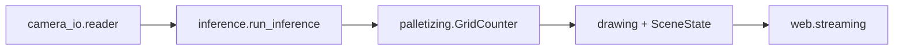

# src/boxarm

```text
src/boxarm/
  config.py
  capture/camera_io.py
  runtime/{pipeline,workers,recording}.py
  vision/{inference,palletizing,drawing,isometric}.py
  web/streaming.py
```

| M?dulo | Responsabilidad |
|---|---|
| `vision.inference` | YOLO `predict`, observaciones y gate robot?ROI |
| `vision.palletizing` | identidad `(celda,nivel)`, soporte y conteo |
| `vision.drawing` | overlay 2D |
| `vision.isometric` | proyecci?n diagn?stica 3D |
| `capture.camera_io` | fuentes de video/c?mara |
| `runtime.pipeline` | procesos, colas y ciclo de vida |
| `web.streaming` | MJPEG, p?gina ISO y `SceneState` |


